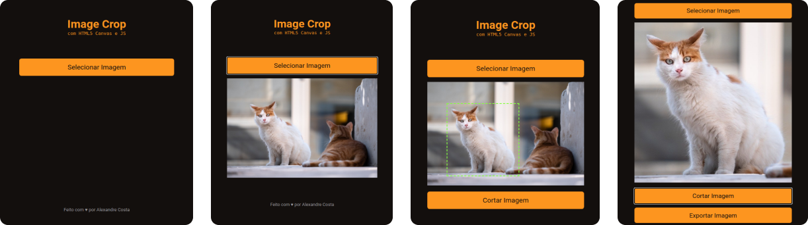

<h1 align="center">
  Cropped Images
  <br />
  <a href="https://www.linkedin.com/in/alexandre-costa-401699199">
    
  </a>
  <a href="https://github.com/alexandredev3/proffy/network">
    
  </a>
  <a href="https://github.com/alexandredev3/proffy/stargazers">
    
  </a>
</h1>
<p align="center">
 <a href="#description">Descrição</a> •
 <a href="#design">App</a> • 
 <a href="#features">Funcionalidades</a> • 
 <a href="#tecnologias">Tecnologias</a> •
 <a href="#install">Instalação</a> •
 <a href="#author">Autor</a> •
</p>
<p align="center" id="description">
  Mini App para cortar imagens, feito com o Canvas do HTML5 e Javascript puro.
</p>
<h1 align="center" id="design">
  
</h1>

<h2 id="features">
  📖 Features
</h2>

- [x] Selecionar uma imagem por vez.
- [x] Cortar a imagem, com base na seleção que o usuário fez.
- [x] Fazer download da imagem cortada.

<h2 id="tecnologias">
  🛠 Tecnologias
</h2>

 As seguintes ferramentas foram usadas na construção do projeto:

- Javascript
- HTML Canvas

<h2 id="install">
   📜️ Instalação
</h2>

### Pré-requisitos

Antes de começar, você vai precisar ter instalado em sua máquina o [Git](https://git-scm.com) 
Além disto é bom ter um editor para trabalhar com o código como [VSCode](https://code.visualstudio.com/)

```bash
# Clone este repositório
$ git clone <https://github.com/alexandredev3/cropped-images.git>

# Vá para a pasta server
$ cd cropped-images
```
Instale a extensão [Live Server](https://marketplace.visualstudio.com/items?itemName=ritwickdey.LiveServer) 
caso você esteja usando o editor de texto Visual Studio Code, Clique com o botão direito do seu mouse, depois clique em __Open With Live Server__.
Você também pode usar o [Lite Server](https://www.npmjs.com/package/lite-server) para rodar a aplicação.

<h2 id="author">
   👷️ Autor
</h2>

<a href="https://github.com/alexandredev3/">
 
 <br />
 <sub><b>Alexandre Costa</b></sub>
</a>


Feito com ❤️ por Alexandre Costa 👋🏽 Entre em contato!🚀

<a href="https://www.linkedin.com/in/alexandre-costa-401699199">
  
</a>
